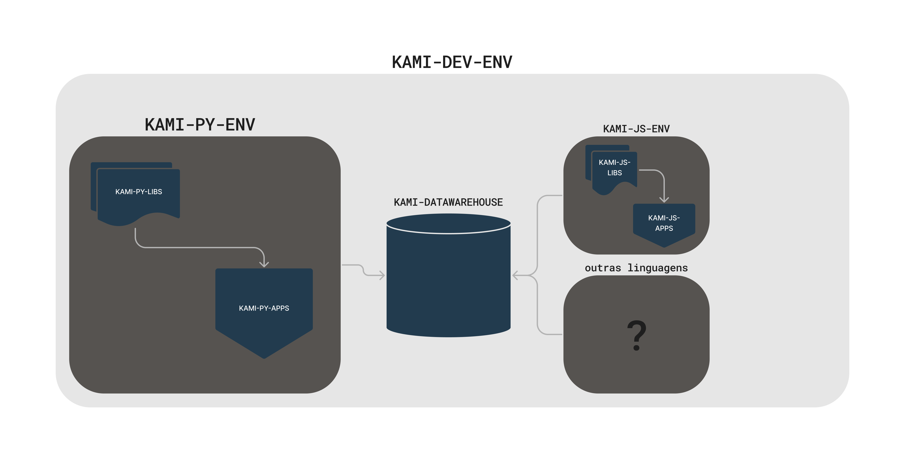

# Construindo um Ambiente de Desenvolvimento Robusto com kami-dev-env

## Sumário
- [Introdução ao kami-dev-env](#introdução-ao-kami-dev-env)
- [Organização de Código e Melhores Práticas](#organização-de-código-e-melhores-práticas)
  - [Criando um Ambiente de Desenvolvimento Padrão](#criando-um-ambiente-de-desenvolvimento-padrão)
  - [kami-py-env - Padrões de Desenvolvimento em Python](#kami-py-env---padrões-de-desenvolvimento-em-python)
  - [Arquitetura Funcional](#arquitetura-funcional)
  - [Boas Práticas de Programação em Equipe](#boas-práticas-de-programação-em-equipe)
- [Colaboração e Rotina](#colaboração-e-rotina)
  - [Compartilhamento e Colaboração](#compartilhamento-e-colaboração)
  - [Rotina para Atualizações e Publicação](#rotina-para-atualizações-e-publicação)
- [Conclusão](#conclusão)
- [Sessão de Perguntas e Respostas](#sessão-de-perguntas-e-respostas)

---

## Introdução ao kami-dev-env

*Diagrama 1: Ambiente de Desenvolvimento KAMI CO.*

- Introdução ao kami-dev-env e sua importância no desenvolvimento de software.
- Visão geral dos objetivos e metas da organização para o ambiente de desenvolvimento.
- O papel do compartilhamento de código e colaboração no desenvolvimento de software moderno.

---

## Organização de Código e Melhores Práticas

### Criando um Ambiente de Desenvolvimento Padrão
- Explicação da configuração e arquitetura do kami-dev-env.
- Estabelecimento de padrões de codificação e melhores práticas.
- Estrutura de diretórios e sistema de controle de versão (por exemplo, Git).

### kami-py-env - Padrões de Desenvolvimento em Python
- Seleção de Bibliotecas Padrão:
  - Análise de Dados e BI: Pandas e Polars
  - Requisições HTTP e Consumo de API: requests e hhtpx
  - Orquestração de Código: Poetry
  - Exemplos Adicionais:
    - Desenvolvimento Web: Flask ou Django
    - Aprendizado de Máquina: scikit-learn
    - Visualização de Dados: Matplotlib ou Plotly
    - Testes: pytest
- Rotina de Desenvolvimento com Poetry:
  - Criação e gerenciamento de ambientes virtuais Python.
  - Gerenciamento de dependências com pyproject.toml.
  - Publicação de pacotes no PyPI para uso interno.
- Dockerização:
  - Empacotamento de aplicativos e automações como contêineres Docker.
  - Benefícios da containerização para consistência e reprodutibilidade.

### Arquitetura Funcional
 Responsabilidades de Cada Membro da Equipe:
  - Adriana Koja (Analista de Requisitos Funcionais / PO):
    - Coleta e priorização de requisitos funcionais.
    - Definição do roadmap do produto e backlog de funcionalidades.
    - Atuação como Product Owner (PO) no framework Scrum.
  - Maicon de Menezes (Analista de Requisitos Técnicos / Scrum Master):
    - Análise de requisitos técnicos e restrições.
    - Facilitação das cerimônias do Scrum e garantia de que a equipe siga os princípios ágeis.
    - Atuação como Scrum Master.
  - Gustavo Lima (Desenvolvedor Backend / Analista de Dados):
    - Desenvolvimento de componentes de backend e soluções de análise de dados.
    - Garantia de qualidade e desempenho dos dados.
  - Diego Rodrigues (Testador / Q&A):
    - Ênfase em Documentação e Testes:
      - Criação de planos de teste, casos de teste e dados de teste.
      - Execução de testes manuais e automatizados.
      - Documentação de defeitos e verificação de correções.
      - Garantia de documentação de alta qualidade para todos os aspectos do projeto.

### Boas Práticas de Programação em Equipe

- Cinco Dicas para Códigos Legíveis, Escaláveis e Extensíveis:
  1. Escolha de Nomes Descritivos para Variáveis, Funções e Classes.
  2. Utilize Comentários de Forma Estratégica e Clara.
  3. Divida o Código em Funções e Arquivos para Reutilização e Legibilidade.
  4. Siga Padrões de Codificação Consistentes.
  5. Realize Revisões de Código em Equipe.

#### Importância da Escolha de Bons Nomes
- A escolha adequada de nomes para variáveis, funções e classes.
- Dicas sobre quando e como usar comentários de maneira eficaz.

#### Estrutura do Código (Design de Software)
- Divisão do código em funções e arquivos para facilitar a reutilização e melhorar a legibilidade.
- Boas práticas de design de software para desenvolvimento em equipe.

---

## Colaboração e Rotina

### Compartilhamento e Colaboração
- Fluxos de trabalho colaborativos com Git:
  - Estratégias de ramificação (ramos de funcionalidades, ramos de lançamento).
  - Solicitações de pull e revisões de código.
- Compartilhamento de bibliotecas internas no PyPI:
  - Melhores práticas de publicação.
  - Versionamento e dependências.
- Registro de Contêiner (Docker Hub):
  - Upload e gerenciamento de imagens Docker.
- GitHub:
  - Gerenciamento de repositórios.
  - Integração de CI/CD (por exemplo, GitHub Actions).

### Rotina para Atualizações e Publicação
- Rotina para atualizar bibliotecas internas:
  - Controle de versão e versionamento semântico.
  - Testes automatizados e integração contínua.
- Publicação no PyPI e Docker Hub:
  - Pipelines de lançamento automatizadas.
- Estudo de caso: Demonstração da atualização e publicação de um projeto de exemplo.

---

## Conclusão
- Resumo das principais conclusões da apresentação.
- A importância de um ambiente de desenvolvimento bem estruturado.
- Incentivo para a adoção de melhores práticas e técnicas de colaboração.

---

## Sessão de Perguntas e Respostas
- Abra o espaço para perguntas e discussão.
